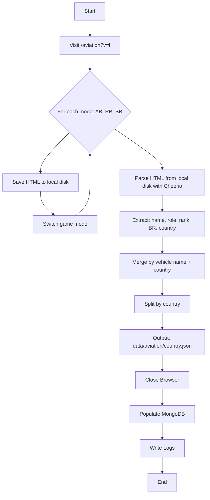
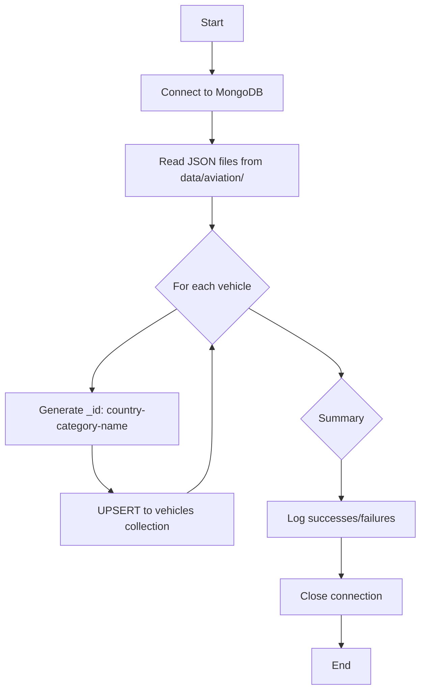
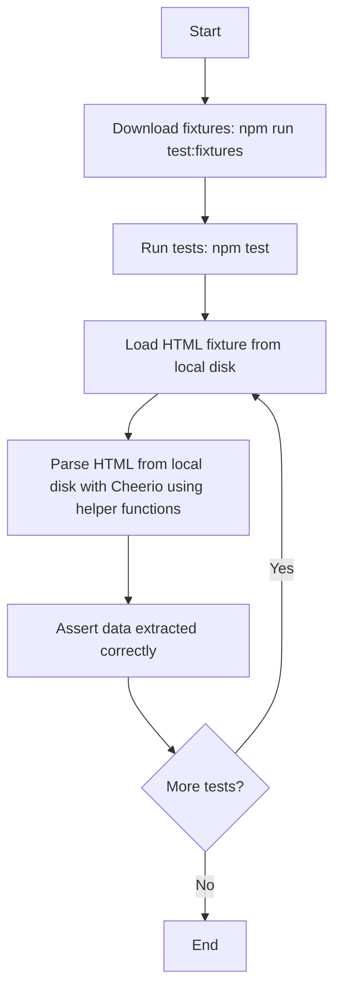
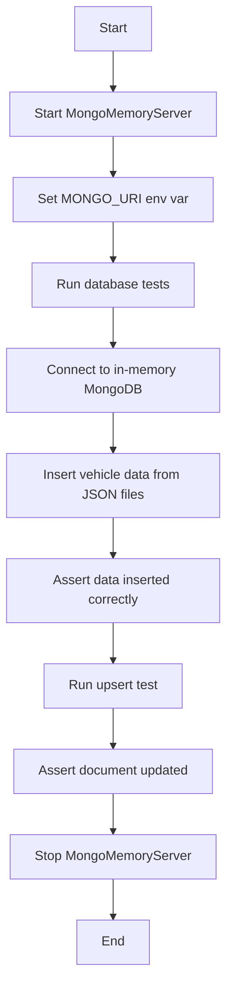

# War Thunder Wiki Scraper

A TypeScript web scraper that collects aviation vehicle data from the War Thunder Wiki. Scrapes vehicle names, ranks, battle ratings (Arcade/Realistic/Simulator), and roles for all countries from a single page visit.

## Environment Variables

Copy `.env.example` to `.env` and configure:

```bash
MONGO_URI=mongodb://localhost:27017
MONGO_DB=warthunder
```

## Requirements

- **Node.js** - v18 or higher
- **MongoDB** - v6 or higher
- **MongoDB Compass** - Any version

 ## Getting Started

```bash
# Start a locally running MongoDB instance
docker run --name mongodb -p 27017:27017 -d mongodb/mongodb-community-server:latest
docker container ls

# Install dependencies
npm install

# Scrape data (default: aviation) + populate database
npm run scrape

# Scrape with verbose logging (includes DEBUG level)
npm run scrape -- --verbose

# Scrape but skip database population
npm run scrape -- --skip-db

# Populate database from existing JSON files
npm run db:populate

# Initialize database connection (test connection)
npm run db:init

# Download test fixtures (run before tests)
npm run test:fixtures

# Run tests
npm test

# Build TypeScript
npm run build

# Lint code
npm run lint

# Format code
npm run format
```

## Project Structure

```
.
├── src/                                    # Source code
│   ├── index.ts                            # Main entry point, CLI handling
│   ├── scraper/                            # Core scraping logic
│   │   ├── browser.ts                     # Playwright browser setup
│   │   ├── scraper.ts                     # Main scraping orchestration
│   │   ├── parser.ts                      # HTML parsing with Cheerio, helper functions
│   │   ├── output.ts                      # JSON and HTML file output
│   │   ├── database.ts                    # MongoDB population logic
│   │   └── types.ts                       # TypeScript interfaces
│   └── utils/                             # Utilities
│       ├── logger.ts                      # Level-based logging (ERROR/WARN/INFO/DEBUG)
│       └── fixtures.ts                    # Download HTML fixtures for testing
├── data/                                   # Output data files
│   ├── aviation/                          # JSON files per country
│   │   ├── usa.json
│   │   ├── germany.json
│   │   ├── japan.json
│   │   ├── italy.json
│   │   └── france.json
│   └── raw/                               # Raw HTML from scraping
│       ├── aviation-arcade.html
│       ├── aviation-realistic.html
│       └── aviation-simulator.html
├── test/                                   # Test files
│   ├── fixtures/                          # HTML fixtures for testing
│   │   ├── aviation-ab.html
│   │   ├── aviation-rb.html
│   │   └── aviation-sb.html
│   └── parser.test.ts                    # Parser unit tests using helper functions
├── logs/                                   # Error and warning logs
│   ├── scraping/                          # Scraping errors and warnings
│   │   ├── errors.txt
│   │   └── warnings.txt
│   └── db-population/                    # Database population errors and warnings
│       ├── errors.txt
│       └── warnings.txt
├── dist/                                   # Compiled JavaScript
├── .env                                    # Environment variables (not committed)
├── .env.example                           # Environment variable template
├── AGENTS.md                              # Guidelines for AI agents
├── package.json                           # Dependencies and scripts
├── tsconfig.json                          # TypeScript config
├── vitest.config.ts                       # Vitest config
├── eslint.config.js                       # ESLint config
└── README.md                              # This file
```

## Architecture

### Full Flow (Scraping + DB Population)



### Database Population Flow



### Test Flow



### Database Test Flow



## Helper Functions

The parser module exports reusable helper functions that are used by both the scraper and tests:

```typescript
// Selectors
SELECTORS.VEHICLE_ROW  // 'tr.wt-ulist_unit--regular'
SELECTORS.NAME         // 'td.wt-ulist_unit-name span'
SELECTORS.ROLE         // 'td:nth-child(2) span'
SELECTORS.RANK         // 'td:nth-child(4)'
SELECTORS.BR           // 'td.br'
SELECTORS.COUNTRY      // 'td.wt-ulist_unit-country'

// Helper functions
getVehicleRows($)       // Get all vehicle row elements
extractName($, row)     // Extract vehicle name
extractRole($, row)     // Extract vehicle role
extractRank($, row)     // Extract vehicle rank
extractBR($, row)       // Extract battle rating
extractCountry($, row)  // Extract country from data-value attribute
parseHtmlTable(...)     // Parse entire HTML table
```

This approach avoids code duplication between the scraper and tests, ensuring consistent parsing logic.

## Logging

The logger supports four levels:

- **ERROR** - Always printed, used for failed requests and selector failures
- **WARN** - Printed by default, used for missing data fields
- **INFO** - Printed with default logging, shows progress
- **DEBUG** - Only printed with `--verbose` flag, shows detailed flow

Logs are organized by subdirectory:
- `logs/scraping/` - Scraping phase errors and warnings
- `logs/db-population/` - Database population phase errors and warnings

## Data Output

### JSON Structure

```json
{
  "country": "usa",
  "category": "aviation",
  "vehicles": [
    {
      "name": "A-20G-25",
      "rank": 2,
      "battleRating": {
        "arcade": 2.7,
        "realistic": 2.7,
        "simulator": 3
      },
      "role": "Strike aircraft"
    }
  ]
}
```

### MongoDB Document Structure

```json
{
  "_id": "usa-aviation-A-20G-25",
  "country": "usa",
  "category": "aviation",
  "name": "A-20G-25",
  "rank": 2,
  "battleRating": {
    "arcade": 2.7,
    "realistic": 2.7,
    "simulator": 3
  },
  "role": "Strike aircraft",
  "source": {
    "file": "data/aviation/usa.json"
  },
  "lastUpdatedAt": "2024-01-15T10:30:00.000Z"
}
```

### Error/Warning Format

Errors and warnings are organized by subdirectory, country, and category in `logs/scraping/errors.txt` and `logs/scraping/warnings.txt`:

```
=== USA ===
aviation:
  - https://wiki.warthunder.com/aviation?v=l
    Selector failed: tr.wt-ulist_unit--regular
```

```
=== USA ===
aviation:
  - A-20G-25: missing role
```
